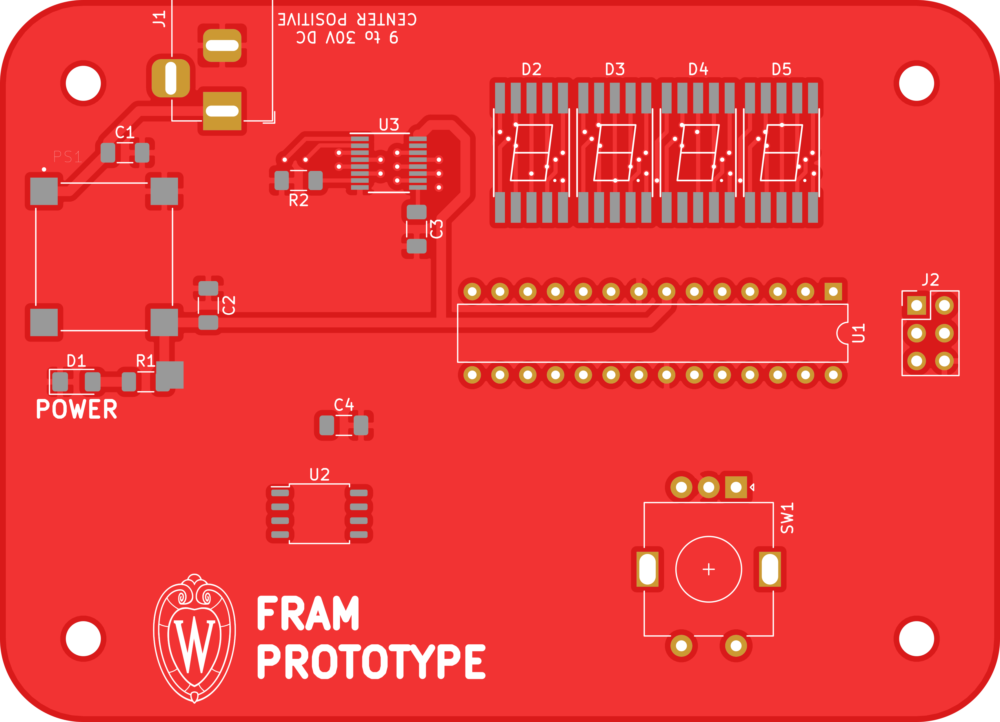
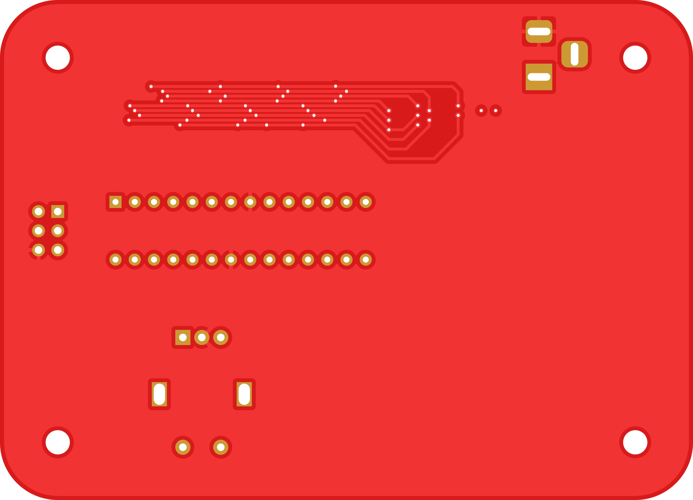

# fram-prototype

Circuit demonstrating functionality of non-volatile, highly endurant ferroelectric RAM.

## PCB

This PCB was designed using KiCAD version 5.
Refer to `fram-prototype.pdf` for schematic.
PCB images generated with [tracespace](https://github.com/tracespace/tracespace) follow.

Bill of Materials

| reference      | value         | manufacturer | part number | DigiKey | Newark |
| :------------- | :------------ | :----------- | :---------- | :------ | :----- |

## Firmware

TODO
